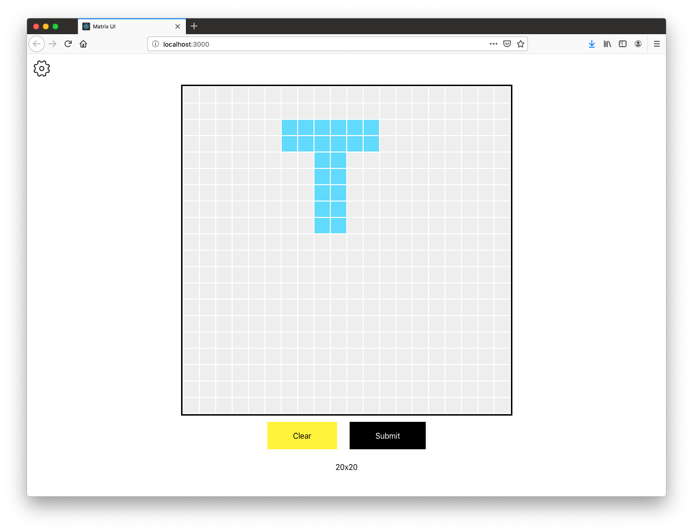

# Matrix UI

Simple UI for configurable matrix data. Can submit matrix data to any back-end via HTTP Rest API.

This was made to visually create some matrix data so it could be passed to a back-end. I was inspired while working on some matrix-based coding problems.

This project was bootstrapped with [Create React App](https://github.com/facebook/create-react-app).

## Launch

In the project directory, you can run:

### `npm start`

Runs the app in the development mode. 
Open [http://localhost:3000](http://localhost:3000) to view it in the browser.

The page will reload if you make edits. 
You will also see any lint errors in the console.

## Matrix API

Here is an example of how the UI sends a 3x3 matrix to the back-end.

    POST http://localhost:8080/matrix
    {
    	"data": [
    		[0, 0, 0],
    		[0, 0, 0],
    		[0, 0, 0]
    	]
    }
    
    Response 200:
    {
    	"message": "Some output to print in the UI"
    }
